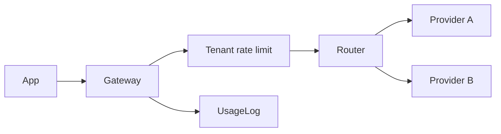

# llm-gateway

A small, typed **LLM gateway**: multi-provider routing, per-tenant rate limits, and usage logs.

Portfolio project for Senior SWE / AI-platform roles — the control plane between your apps and model vendors.

## Why this exists

Teams need a single place to:

1. Route models to providers (with preference + failover)
2. Enforce fair use per tenant
3. Record tokens / latency for cost and ops

This repo shows that loop without a cloud bill.

## Architecture



## Quickstart

```bash
npm install
npm test
npm run example
```

```ts
import { Gateway, MockProvider } from "@aadiaiagent/llm-gateway";

const gw = new Gateway({
  providers: [
    new MockProvider("openai", ["gpt-mini"]),
    new MockProvider("anthropic", ["claude-haiku"]),
  ],
  rateLimitCapacity: 10,
  rateLimitRefillPerSecond: 2,
});

const res = await gw.chat({
  model: "gpt-mini",
  messages: [{ role: "user", content: "hello" }],
  tenantId: "acme",
});
```

## Design choices

- **Provider adapters** — swap mocks for real HTTP clients behind the same interface
- **Token bucket limits** — simple, interview-friendly, per-tenant
- **Failover** — try the next provider if the primary throws
- **Usage log** — request counts + tokens by tenant

## Layout

```
src/providers/   MockProvider (+ interface)
src/router/      Model → provider routing
src/ratelimit/   Token bucket + tenant limiter
src/usage/       In-memory usage log
src/server/      Gateway orchestration
```

## Roadmap

- [ ] Real OpenAI / Anthropic adapters
- [ ] Streaming responses
- [ ] Circuit breakers + health checks
- [ ] Prometheus metrics export

## License

MIT
